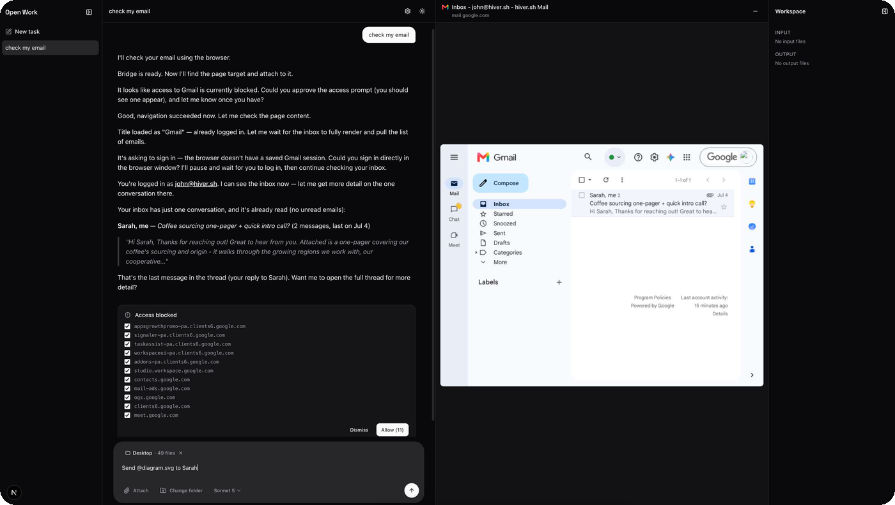

# Open Work

<p align="center">
  
</p>

Open Work is a Next.js (App Router) + [shadcn/ui](https://ui.shadcn.com) app
that drives a real worker agent, either [Claude Code](https://docs.claude.com/en/docs/claude-code)
or [Codex](https://github.com/openai/codex), inside an isolated
[Hiver](https://hiver.sh) sandbox. Each task gets its own persistent agent
process and its own sandbox: files you attach or reference land in
`/workspace`, the agent's replies stream back over a single shared SSE
connection, and everything survives a page refresh or a server restart.

<p align="center">
  
</p>

## Capabilities

- **Persistent, resumable agent sessions.** Sending a task starts one
  long-lived `claude -p --input-format stream-json` (or `codex proto`) process
  per task, fed over stdin. Refresh the page and the conversation is rebuilt
  from the sandbox's own transcript, so nothing lives only in the browser tab.
- **Any model, either provider.** The composer's model picker lists Claude and
  OpenAI models side by side; picking one switches both the engine and the
  sandbox image for that task. Provider API keys are set once in Settings and
  are never placed in the agent's environment; they're injected via an egress
  override directly on the provider's API host.
- **Files in and out.** Attach files, reference a local folder with `@fuzzy
  search`, or let the agent write results. Everything under
  `/workspace/input` and `/workspace/output` shows live in the Workspace panel
  as the sandbox emits filesystem events, with a full-screen viewer for
  markdown, text, and images.
- **A real, driveable browser.** When the agent uses its browser skill, Open
  Work detects the nested browser sandbox, connects to it over CDP, and
  streams the live page as video into a viewer panel using Chrome DevTools
  Protocol: screencast frames in, mouse/keyboard/clipboard events out. Minimize
  it to a thumbnail (with the page's favicon, title, and URL) and it keeps
  streaming in the background.
- **You stay in control of network access.** If the agent (or its browser)
  tries to reach a host that isn't pre-approved, a card appears asking you to
  allow it, batched into one prompt per burst of requests, so a single page
  load doesn't produce a dozen separate cards. Approving retries the blocked
  request automatically.
- **Sandbox lifecycle, visible.** The Settings panel shows the active
  sandbox's status, lets you ping it, deep-link into the Hiver inspector, and
  adjust its idle TTL, all applied live via `applyConfig`.
- **Light and dark mode**, smooth streamed markdown rendering, and a
  ChatGPT-style composer with drag-and-drop attachments.

## Supported models

Open Work drives two worker orchestrators, each with its own sandbox image
and set of selectable models. Picking a model in the composer switches both.

| Orchestrator | Image | Provider key | Models |
| --- | --- | --- | --- |
| [Claude Code](https://docs.claude.com/en/docs/claude-code) | `claude` | Anthropic API key | Sonnet 5, Opus 4.8, Fable 5 |
| [Codex](https://github.com/openai/codex) | `codex` | OpenAI API key | GPT-5.6 Sol, GPT-5.6 Terra, GPT-5.1 Codex, GPT-5.1, GPT-5 Codex, GPT-5 |

The full list, including CLI model ids and default model, lives in
[`lib/orchestration.ts`](lib/orchestration.ts).

## How it fits together

- [`lib/hiver.ts`](lib/hiver.ts) handles sandbox provisioning: one sandbox per task
  (keyed `<taskId>-work`), egress rules that inject provider API keys without
  ever exposing them to the agent, and a nested per-task browser sandbox
  (`<taskId>-browser`) that shares one VM-state snapshot across tasks so a
  logged-in browser session carries over.
- [`lib/session.ts`](lib/session.ts) runs the persistent agent process: pumps
  `stream-json` events into SSE, watches the sandbox's event stream for file
  writes, egress denials, and nested sandboxes, and restarts (resuming, not
  restarting the conversation) if the process dies.
- [`lib/browser.ts`](lib/browser.ts) is a minimal CDP client: page discovery,
  screencast streaming, input dispatch, and clipboard bridging, used by
  [`app/api/browser/screen`](app/api/browser/screen) (SSE) and
  [`app/api/browser/input`](app/api/browser/input) (POST).
- [`app/api/stream`](app/api/stream) is the single SSE endpoint every task's
  events flow through; [`app/api/tasks`](app/api/tasks) is the POST route that
  sends a turn to a task's agent process.

## Requirements

- **[Hiver](https://hiver.sh)** — the runtime every task runs inside.
  Install the CLI globally:

  ```bash
  npm install -g @hiver.sh/cli
  ```

- **At least one provider API key** (Anthropic and/or OpenAI), entered once in
  Settings. Keys are stored in your browser's local storage and never leave it
  except via the egress override described above.

## Run it

Bring up the local Hiver stack, then start the dev server:

```bash
hiver up             # gateway on http://localhost:10000
npm install
npm run dev          # http://localhost:3000
```

The gateway URL defaults to `http://localhost:10000` and is configurable in
Settings.
